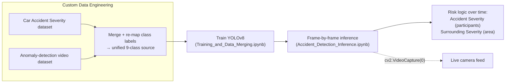

<div align="center">

# Real-Time Accident & Traffic Analysis — YOLOv8

### Custom 9-class detector with temporal severity scoring

[](https://python.org)
[](https://github.com/ultralytics/ultralytics)
[](https://pytorch.org)
[](https://opencv.org)

**A real-time traffic-analysis system built on a custom-trained YOLOv8 model that detects 9 classes and applies temporal logic to score incident severity.**

</div>

---

## Pipeline



## Key Features

- **Multi-class detection** — 9 distinct traffic classes for detailed scene analysis
- **Temporal risk assessment** — analyzes detections across frames to compute two metrics: **Accident Severity** (for participants) and **Surrounding Severity** (for the general area)
- **Custom data engineering** — merges two Kaggle datasets and re-maps class labels into one robust training source
- **Real-time ready** — swap the video-file input for `cv2.VideoCapture(0)` to run on a live camera

## Datasets

- [Car Accident Severity Dataset](https://www.kaggle.com/datasets/ahmedmoorsy/car-sevraccid)
- [Video Dataset for Anomaly Detection](https://www.kaggle.com/datasets/farahalshehhi/videodata)

## Workflow

| Notebook | Purpose |
|---|---|
| `Training_and_Data_Merging.ipynb` | data merging + YOLOv8 training |
| `Accident_Detection_Inference.ipynb` | loads the model, runs analysis on sample data |

## Setup

```bash
git clone https://github.com/YazanAi-Dev3/Accident-Detection-YOLOv8.git
cd Accident-Detection-YOLOv8
pip install -r requirements.txt
```

## Tech Stack

`Python` · `Ultralytics YOLOv8` · `PyTorch` · `OpenCV` · `Pandas` · `Kaggle API`
